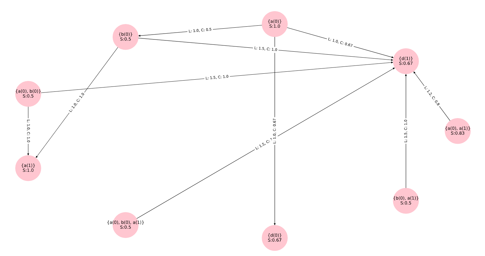
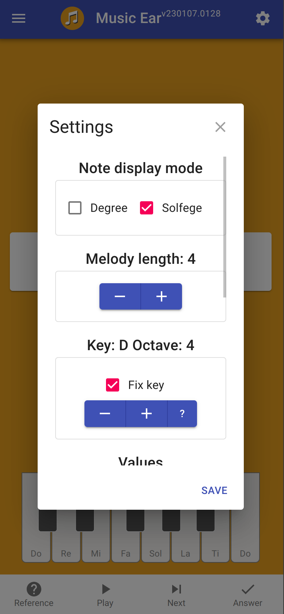
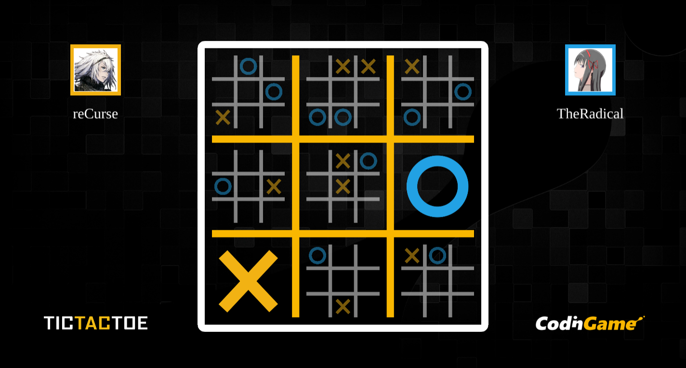

<h1 align="center">Chan Young Song</h1>
<h3 align="center">A machine learning engineer keen on continued learning</h3>

# Github Portfolio

## Inter-Transactional Patterns Miner(itpminer) python package: [Github link](https://github.com/Local-E-Rewards-ML/itpminer)

While working for [Local E](https://www.burdi.app/)(since renamed to burdi) between 2021-22, I and my colleague [o-j-bradley](https://github.com/o-j-bradley) implemented an association rule mining algorithm based on an existing research paper. This is a good example of tested and typed python implementation which has been published in pypi and conda. My contributions:

-   Understand and implement the algorithm as set by the paper:

        Anthony J.T. Lee, Chun-Sheng Wang, An efficient algorithm for mining frequent inter-transaction patterns, Information Sciences, Volume 177, Issue 17, 2007, Pages 3453-3476, ISSN 0020-0255, https://doi.org/10.1016/j.ins.2007.03.007. (https://www.sciencedirect.com/science/article/pii/S002002550700151X) Keywords: Association rules; Data mining; Inter-transaction patterns

-   Automated testing using [pytest](https://docs.pytest.org/)
-   Make the code typed using [mypy](https://github.com/python/mypy)
-   Generate package using [cookiecutter](https://github.com/cookiecutter/cookiecutter)
-   Publish on [pypi](https://pypi.python.org/pypi/itpminer) and [conda-forge](https://anaconda.org/conda-forge/itpminer)

## Music Ear: [Github link](https://github.com/chanyoungs/musicear)

This was a personal project to create a web app for training your musical ear for attaining relative pitch. Deployed link: [musicear.web.app](https://musicear.web.app/).

Technology used:

-   React
-   Redux
-   Typescript
-   Firebase
-   Material-UI

## Monte Carlo Tree Search in C++: [Github link](https://github.com/chanyoungs/Ultimate-Tic-Tac-Toe-CPP)

This project was used to enter for an online AI bot competition for a game of [Ultimate Tic Tac Toe](https://www.codingame.com/multiplayer/bot-programming/tic-tac-toe) in [codingame.com](https://www.codingame.com).

-   Monte Carlo Tree Search algorithm has been implemented from scratch in C++
-   The bot put me up in Gold League

## Custom neural network implementation using NumPy: [Github link](https://github.com/chanyoungs/Machine-Learning)

In this mini project, MNIST was solved using various ML libraries:

-   Keras
-   Tensorflow
-   Pytorch
-   NumPy

Of note, a custom neural network layers module `chanflow` was implemented using NumPy which mimics the call structure of `tensorflow`.

# Languages and Tools:

    
    
    
    
    
    
    
    
    
    
    
    
    
    
    
    
    
    
    

    

    

